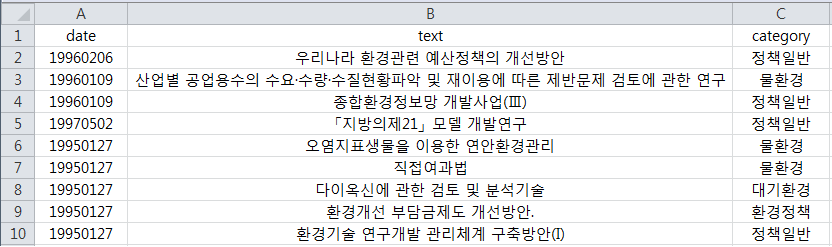

## 키워드 네트워크 활용 메뉴얼

### 1. 데이터 준비 
키워드 네트워크 구성을 수행할 텍스트데이터를 준비 

- 액셀 파일 사용 (*.xlsx파일)  
- 1행 : date(1열,선택), text(2열,필수), category(3열,선택) 입력  
- 2행 이후 : date에는 날짜 (20101111 형태), text에는 분석할 텍스트 리스트, category에는 카테고리(환경 카테고리 등, 그외 분류기준 활용 가능)    

 
- 예시1 : 날짜필터링 또는 카테고리 필터링을 활용할 경우
- 예시1 예제파일 : [다운로드](http://192.168.1.51:8080/kn_test_data/kn_kei_test1.xlsx)  
  

- 예시2 : 날짜필터링 또는 카테고리 필터링을 활용하지 않을 경우 (필터링 기능 활용 불가)
- 예시2 예제파일 : [다운로드](http://192.168.1.51:8080/kn_test_data/kn_kei_test2.xlsx)  

- 그외동일 포맷의 다른 내용 데이터의 사용도 가능

 

### 2. 데이터 업로드 및 데이터 확인  

- 데이터 업로드를 위해 왼쪽에서 'Browse'를 클릭하여 파일엑셀 파일 업로드
- 업로드시 데이터 부분에서 테이블 출력됨
- Display 부분에서 ‘Head’를 선택할 경우 텍스트 파일의 일부 내용을 출력, ‘All’을 선택할 경우 전체 내용을 출력

  

### 3. 필터링 기능 적용 (선택)
왼쪽의 메뉴를 통해 날짜 또는 카테고리를 통해 필터링 기능을 수행할 수 있습니다.이 부분은 옵션으로 전체데이터에서 수행(데이터에 날짜 및 카테고리 정보를 생략한경우)을 위해서는 생략하면 됩니다.  

- 카테고리, 시작날짜, 끝날짜를 설정하고 '필터링 실행'을 클릭하면 오른쪽 그림과 같이 결과가 출력되어 필터링이 진행된것을 확인할수 있으며, 분석시 이 데이터를 활용하여 분석을 진행함

- 본 예시에선 20100101 ~ 20171231, 정책 일반으로 필터링 하고자 하는 경우

  

### 4. 연관 키워드 (네트워크) 분석 수행

연관분석 관련 파라미터인 시드, 지지도, 신뢰도, 관계수값을 설정 후 '분석실행'을 눌러서 분석 실행

- 시드값은 키워드 연관분석 알고리즘 내부에 난수가 사용되는데 이 값에 따라 결과가 달라짐, 시드값은 0이상인 아무값이나 설정한뒤(바꿔가면서) 수행 후 원하는 관계가 도출되면 그 결과를 활용하는 방식으로 사용
- 지지도는 최소 지지도를 의미 (낮을수록 신뢰도 감소 및 많은 관계 도출)
- 신뢰도는 최소신뢰도를 의미 (변경 하는 경우 거의 없음)
- 2개 이상 키워드 활용에 체크를 할경우 2개 이상 단어에 대한 연관관계 출력

- 관계수을 네트워크를 시각화할 때 상위(LIFT 점수기준) 몇 개의 관계를 활용하여 시각화 할 것인지를 나타나는 인자 
- 연관분석에 보다 자세한 내용은 https://ratsgo.github.io/machine%20learning/2017/04/08/apriori/ 웹사이트를 참고

 

### 6. 연관분석 분석 확인 

- 오른쪽 메뉴의 ‘연관분석’를 클릭하면 아래와 같이 연관분석 결과를 확인할 수 있음
- 예를 들면 첫 번째 행의 결과해석은 ‘순환’ 키워드가 ‘자원’ 키워드에 종속되어있다는 의미

 

### 7. 키워드 네트워크 시각화 결과 확인 
- 연과분석 결과를 토대로 시각화 
- 노드(키워드)가 클수록 차수 중심성(degree centrality)가 높은 노드 (많은 엣지와 연결된 노드)
- 붉은 색에 가까울수록 매개 중심성(betweness centrality)가 높은 노드, 즉 전체 네트워크에서 다른 노드(키워드)들과 연관성이 높은 키워드를 의미
- 'Download' 버튼을 클릭할 경우 그림을 다운받을수 있음

 

### 8. 기타 예시 사례
- 기후변화 관련 지방정책 리스트텍스트  [다운로드](http://192.168.1.51:8080/kn_test_data/kn_kei_test3.xlsx)  